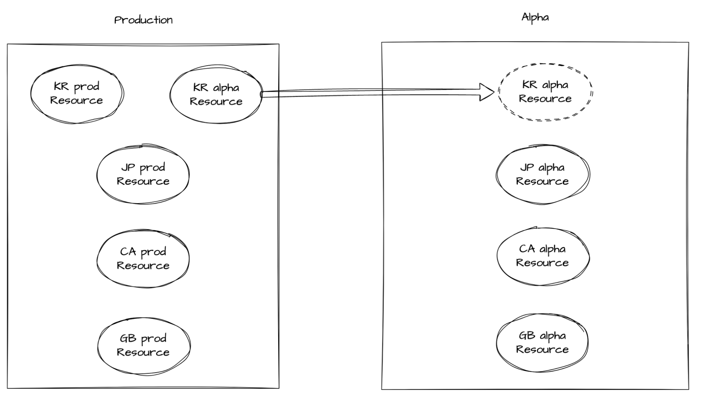
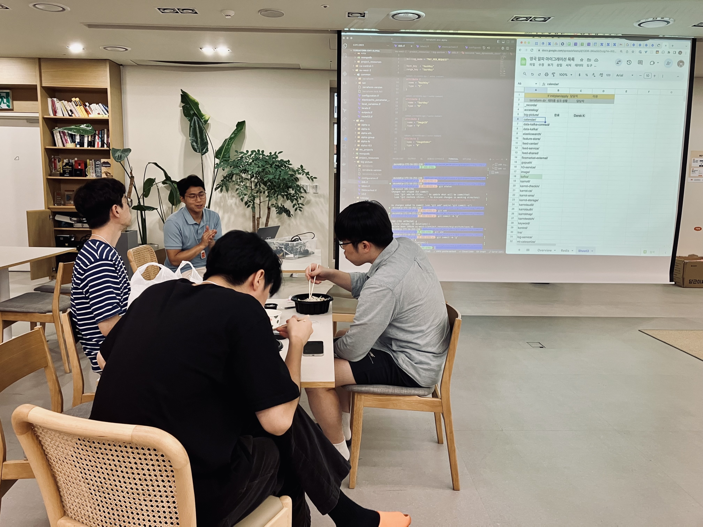

# AWS Resource(dev) Migration to new account for security

- Language: `Python`, `Terraform`
- Tag: `AWS`, `Kubernetes`, `Network`, `Security`, `ArgoCD`, `ElastiCache`, `S3`, `DynamoDB`, `SQS`, `Route53`
- Period: 2023/08/15 → 2023/09/09

## Objective

- Separate the complete environment (Prod/Dev) for enhanced security
  - In Korea/the UK, development(we call it alpha)/production resources are mixed in one account, so it is operating in an inefficient structure from the perspective of security/resource operation. (I will focus on explaining korea resources migration project)
  - So, we made and carried out a plan to move those resources to new(alpha) account with our team and all developers in company.
- Preventing IP address ranges Shortages
  - Because alpha resources and production resources was in one AWS account and one VPC.
  - we was worried about the lack of IP address.
  - So, we aim to move alpha resources to alpha account, and delete alpha subnets in production account to save ip address ranges.
- Prevention of cognitive load for all developers
  - When a new developer join our company, they should know weird architecture like below picture.
    
  - So, we want to get rid of cognitive load for developers.
  - Before this project we have to say like ”korea alpha resources are not in alpha account, but those are with production resources in production account…”
- Avoid complex resource architecture
  - Before this project, some resources are in alpha account, and some resources are also in production account. So If we want to give permissions, it needs unnecessary complex resource architecture using assumed AWS IAM Role between an alpha account and a production account.
  - So We want to remove this kind of complex resource architecture by migrating alpha resources from the production account to the alpha account

## Achievement

- We enhanced security by moving alpha resources to the alpha account.
- We make addition space for ip address range that production VPC uses.
- We delete unnecessary resources after migration tasks with my team if the resources don’t need anymore. (unnecessary ec2, s3, lambda and etc)
- We got rid of cognitive load for all developers

## What I did

- I was a leader of this project, so I planned how we do, and when will do this project.

## Before Migration

- we made a plan how to move alpha resources to the alpha account.

### 1. Make Data migrations Tools

- We decided to support data migration(but not real time, because they are not production resources), so we made data migration api for S3, DynamoDB, and ElastiCache.
- Among those service, I developed S3 data migration api.

### 2. Make alpha aws resources in alpha account

- We made alpha aws resources including network resources and security resources in alpha account before migration day.
- We listed endpoints of newly created alpha resources by service in a sheet.

### 3. Make scenario how to developers can deploy their services to new k8s cluster

- We have two deploy systems, we make each scenario and guide book to migrate services to new EKS cluster for developers.

### 4. Make IAM Roles which are needed for eks pods or Lambda

- We made IAM Roles before migration day.
- Give same permissions with IAM Role in production account.

## Migration Day

- Have developers change to a new resource endpoint in alpha account when they deploy a new service.
- If there are problems after developers deploy their services with new endpoint, SRE participate in troubleshooting.

## After Migration

- Delete all legacy resources in production account after a week.

## Important things when migrating

### 1. We can’t make same s3 bucket

- We can’t make same named s3 bucket.
- So we made a s3 bucket with different name in alpha account
- And we ask developers to carefully check the name of the s3 bucket used by their service

### 2. Make new kms key, and encrypt data with new key

- KMS can't be migrated smoothly just by changing the endpoint, so we told the developers to decrypt the data with the existing kms key and encrypt the data again with the new kms key

### 3. Set same version and same mode for redis cluster

- If the new alpha redis differs from the existing redis in version or mode, it is necessary to create the redis with the same version and mode because of the compatibility issue

### 4. Restrict permissions when deleting legacy resources

- Remove the worker's permission to prevent to delete the production resources for a moment so that SRE can’t delete production resources when deleting the existing resource after migration.
