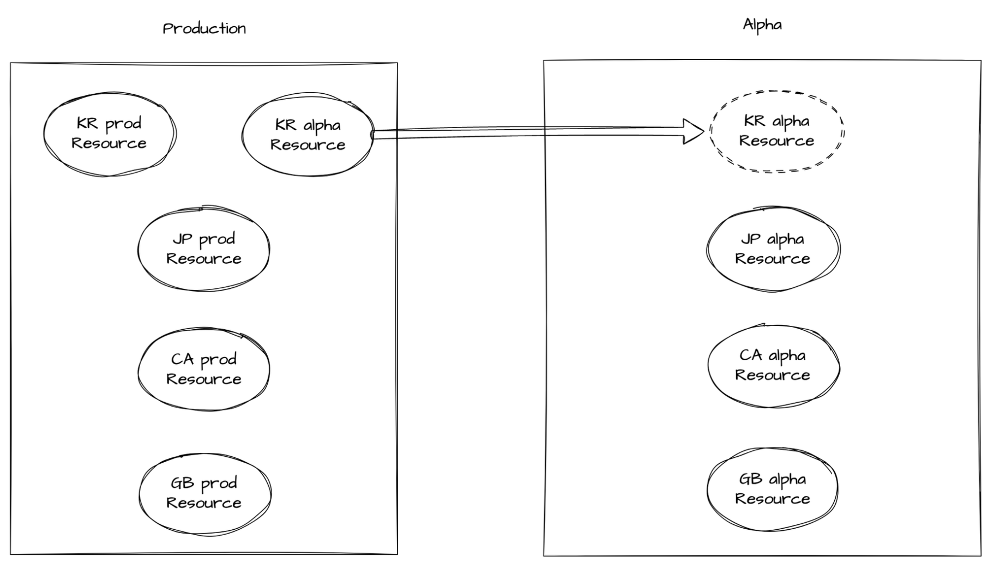
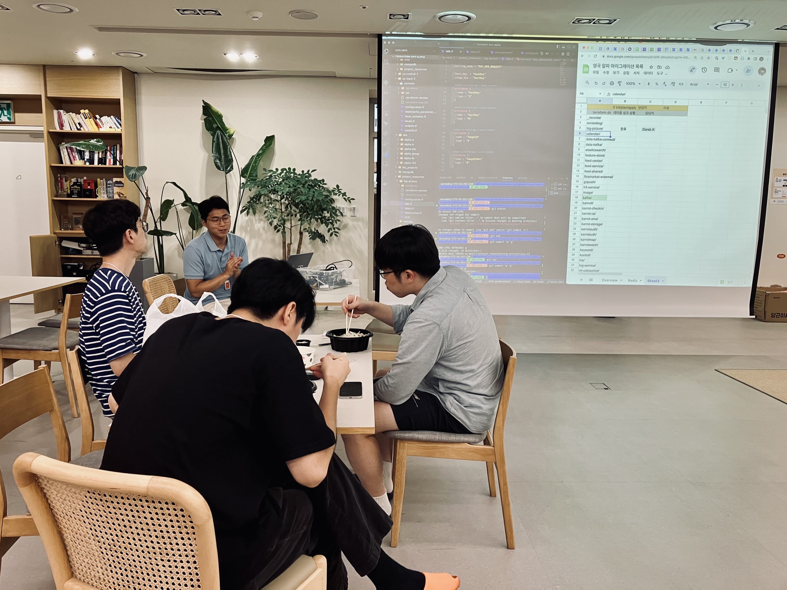

# AWS Resource(dev) Migration to new account for security

- Language: `Python`, `Terraform`
- Tag: `AWS`, `Kubernetes`, `Network`, `Security`, `ArgoCD`, `ElastiCache`, `S3`, `DynamoDB`, `SQS`, `Route53`
- Period: 2023/08/15 → 2023/09/09

## Objective

The project aimed to enhance security by separating development (dev) and production environments originally mixed in our AWS accounts. The focus was to migrate dev resources from the production environment to a dedicated dev environment, improving resource management and security. Additional objectives included preventing IP address shortages, alleviating cognitive load for developers by simplifying architecture, and avoiding complex cross-account resource permissions.

- Separate the complete environment (Prod/Dev) for enhanced security
  - In Korea/the UK, development(we call it alpha)/production resources are mixed in one account, so it is operating in an inefficient structure from the perspective of security/resource operation. (I will focus on explaining korea resources migration project)
  - So, we made and carried out a plan to move those resources to new(alpha) account with our team and all developers in company.
- Preventing IP address ranges Shortages
  - Because alpha resources and production resources was in one AWS account and one VPC.
  - we was worried about the lack of IP address.
  - So, we aim to move alpha resources to alpha account, and delete alpha subnets in production account to save ip address ranges.
- Prevention of cognitive load for all developers
  - When a new developer join our company, they should know weird architecture like below picture.
    
  - So, we want to get rid of cognitive load for developers.
  - Before this project we have to say like ”korea alpha resources are not in alpha account, but those are with production resources in production account…”
- Avoid complex resource architecture
  - Before this project, some resources are in alpha account, and some resources are also in production account. So If we want to give permissions, it needs unnecessary complex resource architecture using assumed AWS IAM Role between an alpha account and a production account.
  - So We want to remove this kind of complex resource architecture by migrating alpha resources from the production account to the alpha account

## Achievement

#### 1. Security Enhancement:

- Successfully segregated dev resources into a dedicated account, improving the security posture and aligning with ISMS security requirements.

#### 2. Improved Resource Management:

- Freed up IP address ranges in the production environment by removing dev subnets and resources.

#### 3. Resource Optimization:

- Cleaned up and deleted unnecessary resources post-migration, such as redundant EC2 instances, S3 buckets, and Lambda functions.

#### 4. Reduced Cognitive Load & Simplified Architecture:

- Simplified the development environment for new developers by maintaining a clear distinction between dev and production environments.
  Eliminated the need for complex cross-account IAM roles.

## What I did

#### 1. Project Leadership:

- Led the entire project lifecycle, including planning, execution, and stakeholder alignment. Ensured all potential challenges were identified and mitigated to facilitate smooth migration.

#### 2. Pre-Migration Preparation:

- Developed data migration tools for services like S3 and DynamoDB, handling data transfers seamlessly. Specifically, worked on creating the S3 data migration API.
- Established dev AWS resources in the new account, including security and network configurations, ensuring readiness for migration.
- Designed deployment and migration scenarios, preparing comprehensive guides for developers to transition their services to the new Kubernetes cluster.

#### 3. Resource and Access Management:

- Configured necessary IAM roles for EKS pods and Lambda functions ensuring smooth operation post-migration.
- Coordinated with developers to alter endpoints to new resources, providing support for any deployment issues.

#### 4. Post-Migration Activities:

- Oversaw the decommissioning of legacy dev resources in the production environment within a week post-migration.
- Worked closely with teams to troubleshoot any service disruptions post-migration.

## Before Migration

- we made a plan how to move alpha resources to the alpha account.

#### 1. Make Data migrations Tools

- We decided to support data migration(but not real time, because they are not production resources), so we made data migration api for S3, DynamoDB, and ElastiCache.
- Among those service, I developed S3 data migration api.

#### 2. Make alpha aws resources in alpha account

- We made alpha aws resources including network resources and security resources in alpha account before migration day.
- We listed endpoints of newly created alpha resources by service in a sheet.

#### 3. Make scenario how to developers can deploy their services to new k8s cluster

- We have two deploy systems, we make each scenario and guide book to migrate services to new EKS cluster for developers.

#### 4. Make IAM Roles which are needed for eks pods or Lambda

- We made IAM Roles before migration day.
- Give same permissions with IAM Role in production account.

## Migration Day

- Have developers change to a new resource endpoint in alpha account when they deploy a new service.
- If there are problems after developers deploy their services with new endpoint, SRE participate in troubleshooting.

## After Migration

- Delete all legacy resources in production account after a week.

## Challenges and Solutions:

#### 1. S3 Bucket Naming Conflicts:

- Challenge: Unable to create S3 buckets with the same name due to global naming constraints.
- Solution: Created S3 buckets with appended identifiers like "new" for clarity and communicated naming conventions clearly to developers.

#### 2. Data Encryption Transitions:

- Challenge: KMS keys cannot be simply migrated by changing endpoints.
- Solution: Advised developers to decrypt data with existing keys and re-encrypt with new KMS keys in the dev environment to ensure data security.

#### 3. Maintaining Compatibility Across Components:

- Challenge: Encountered compatibility issues like differing Redis versions and modes.
- Solution: Ensured the new resources matched existing configurations as closely as possible to maintain compatibility.

#### 4. Avoiding Critical Resource Deletions:

- Challenge: Risk of accidental deletion of production resources during legacy resource cleanup.
- Solution: Implemented temporary restrictions on permissions to prevent unauthorized deletions, providing a safeguard during the cleanup process.
