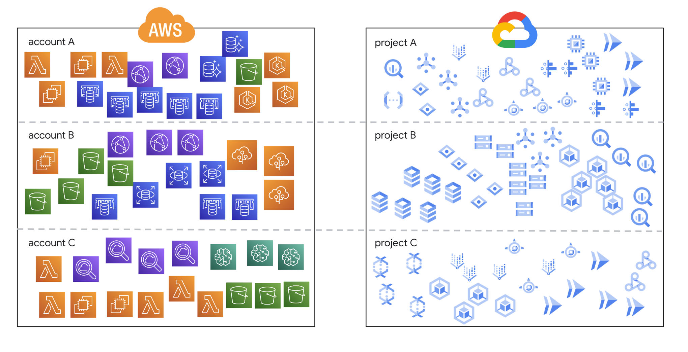

# Project Catalog API development (Katalog)

- Language: Golang, TypeScript
- Tag: DevSecOps, Platform Engineering, SRE
- Period: 2022/01/01 → 2022/08/31

## Objective

- Project(Service) Ownership Management
  - We already had a developer platform where developers can deploy there projects(services) by themselves.
  - But Developers and SRE are hard to know owner of projects.
  - So, it's hard to find developers in charge of a specific project, so it's hard to respond quickly when a failure occurs.
- AWS/GCP Cloud Resource Ownership Management
  - There is also difficulty to identify and manage the cloud resources a project is using.
  - And It is hard to manage Tag and Label system in cloud with terraform.

- Make developer platform DevOps oriented
  - Project ownership management is the basis for creating a devops-based cost management system and a devops-based cloud resource provisioning system.

## Achievement

- After we made this service(katalog), every developers can know ownership of services easily.
- If there is failure of a service, mention slack group and send message slack channel automatically.
- If some cloud resources needed to change their ownership to another project, developers can easily change cloud resources’ ownership by themselves in Developer Platform ,named Kontrol, even though they don’t know how to use terraform.

- After we made a Katalog API server(Ownership management system), It becomes a basis of other system.
- Web Framework: echo
- ORM: GORM
- Test: gomock

## What I did

- I developed backend apis of this service using Golang with another member.
- I made a test code for apis with gomock package.
- I used tageditor api in aws and getting and fixing labels feature of each api in gcp to develop this system.
- I made a cron logic sending HR data to DB periodically.
- I also contribute making UI of developer platform UI(Kontrol) with this service

Youtube Video that I’ve presented: [https://www.youtube.com/watch?v=p1MjEInScbw](https://www.youtube.com/watch?v=p1MjEInScbw)
