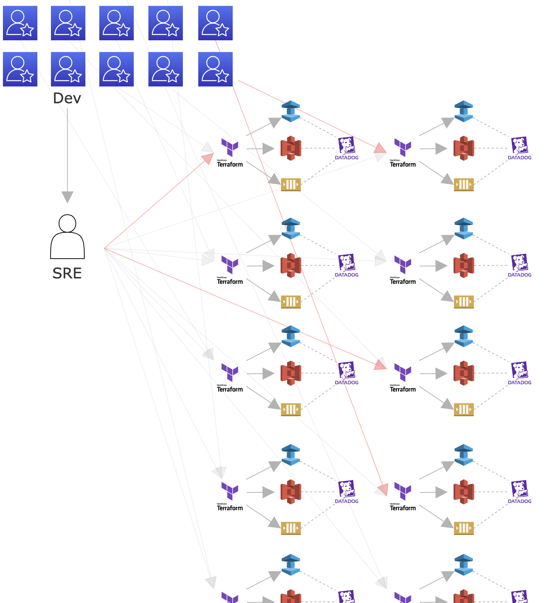

# Cloud Resource Provisioner Development

- Language: Python, TypeScript
- Tag: DevSecOps, Platform Engineering
- Period: 2023/07/04 →

## Objective

- Make developers easily create cloud resources that meet corporate standards even who don't know Terraform and without SRE.
- Make developers create the same resources across multiple regions quickly and easily.
- Make a guardrail automatically when cloud resources are created.

## Achievement

- Developers can create Redis/DynamoDB/Static Websites/S3 which their services use on their own and perform simple operational tasks with this system
- Reduce the repetitive operational tasks performed by SRE

[Before KRP]

[After KRP]

- Web Framework: FastAPI
- ORM: SQLAlchmy
- Test: pytest
- package management: poetry

## What I did

- I am one of developers of KRP(karrot Resource Provisioner) which means Cloud Resource Provisioner.
- I developed features related with S3(Create S3 Bucket, Configure some options, Data Migration)
- I developed features related with GCP Cloud Resource Manager(projects, folder)
