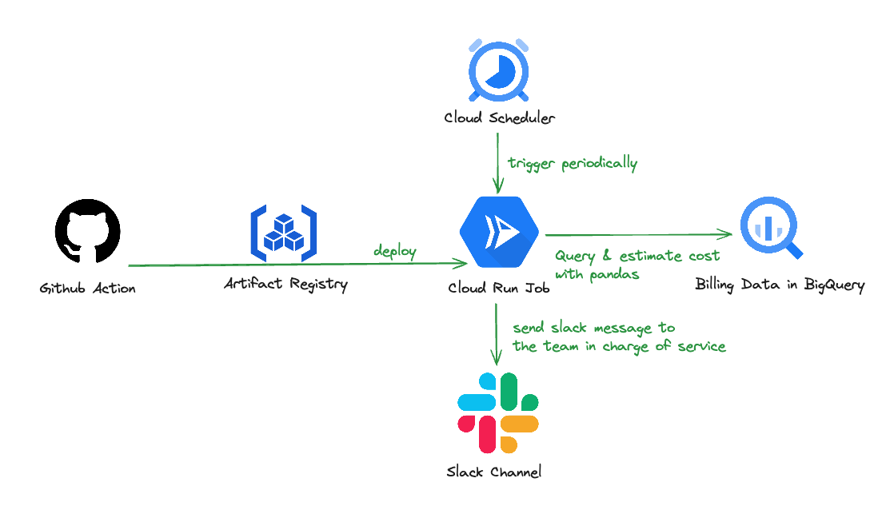

# Machine-learning based cloud cost anomaly detection tool

- Language: Python
- Tag: BigQuery, Cloud Run Job, cost-optimization
- Period: 2023/12/01 → 2023/12/17

## Objective

- Make anomaly detection for gcp cloud resources cost.
- Make a FinOps system and culture for developers.
- We also want to automate the cost report that each development team does every month.

## Achievement

- Unlike AWS, GCP doesn’t provide anomaly detection notifications for suddenly increased cost items as a managed service, so it was manually monitoring the cost, but we made an anomaly detection notification system automatically.
- When costs suddenly surge in unexpected areas, each development team is notified automatically with slack. And They try to find out what’s the reason. We contribute to FinOps culture.

## What I did

- I developed this service using python with another developer.
- I set up CI/CD pipeline and cloud run job.
  - I made a CI/CD pipeline with GtiHub Action.
  - Since this task only needs to be done once a day, I made it with cloud run jobs, not cloud run service.
  - I also gave least permissions to each service.
- I set up system which sends billing anomaly message for each team.
- I will make a feature that makes cost summary report with Generative AI(not yet)
