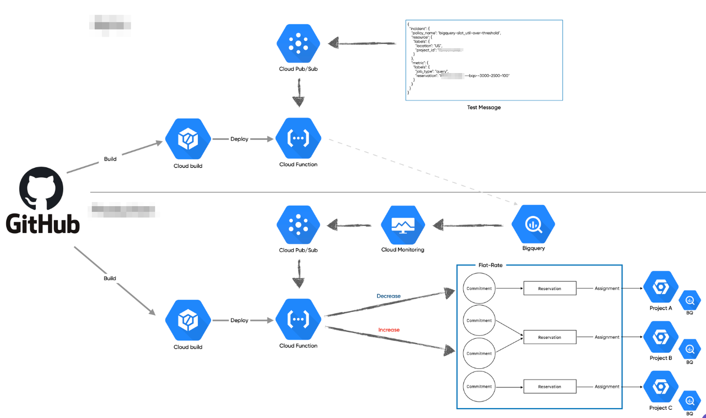

# GCP BigQuery Slot Autoscaler

- Language: Golang
- Tag: BigQuery, Cloud Build, Cloud Function, Cloud Monitoring, Cloud Pub/Sub
- Period: 2022/10/18 → 2023/02/03

## Objective

- Use BigQuery Slot flexibly (When I proceed this project, there wasn’t Google’s BigQuery slot autoscaler)
- When there are a lot of queries, we commit a lot of slots for performance, and when there are a lot of queries, we remove the agreed slots for cost.
- As a result, Optimize both cost and performance.

## Achievement

- BigQuery Slot we’ve committed automatically scale in/out so fast(better than BigQuery slot autoscaler that we have to use now)
- I saved over 50% BigQuery Query cost (about over $ 100,000).
- Even when queries are concentrated, performance efficiency has been achieved by lowering the average query execution time.

## What I did

- I developed this tool by myself.
- I made cloud resources using terraform, and develop codes with Golang
- I made a CI/CD pipeline with Github Action and Cloud Build
- I use cloud function as a server
- Alert based autoscaling rule is made from Cloud Monitoring
  - With custom monitoring query, it is possible to calculate utilization of BigQuery Slot.
  - e.g) over 70% scale up, under 50% scale down

### High slot util → Commit slots & Update Reservation

### Low slot util → Update Reservation & Delete slots

### Slot Autoscaling

