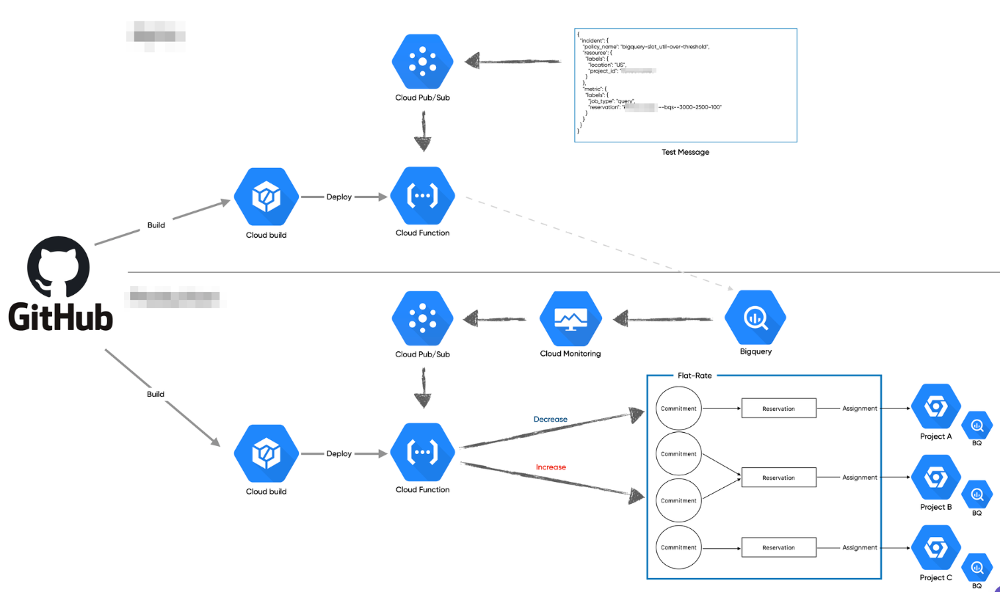

# GCP BigQuery Slot Autoscaler

- Language: Golang
- Tag: BigQuery, Cloud Build, Cloud Function, Cloud Monitoring, Cloud Pub/Sub
- Period: 2022/10/18 → 2023/02/03

## Objective

The primary objective of the GCP BigQuery Slot Autoscaler project was to provide a flexible way to manage BigQuery slot commitments before Google released its own autoscaler feature. The tool was designed to dynamically adjust slot commitments based on query demands, thereby optimizing for both performance and cost efficiency. By scaling the number of slots up during high query loads and scaling down during periods of lower demand, we aimed to maintain optimal query performance while minimizing expensive overprovisioning.

## Achievement

#### 1. Dynamic Slot Scaling:

Developed a tool that automatically scales BigQuery slots both in and out.

#### 2. Greater Flexibility in Slot Scaling:

Unlike Google's native autoscaler that requires setting only the baseline (min) and maximum slots with fixed scaling increments, our tool allows for fine-tuned control over how many slots are scaled at each step. This enables users to precisely tailor scaling behaviors to specific workload demands.

#### 3. Cost Reduction:

Achieved significant cost savings on BigQuery query costs, cutting expenses by over 50% and saving more than $100,000 per month.

#### 4. Performance Optimization:

Managed to lower the average query execution time, ensuring high performance even when query loads were concentrated.

## What I did

#### 1. Development and Infrastructure:

- Independently developed the autoscaler application in Golang.
- Utilized Terraform to provision necessary cloud resources, ensuring the infrastructure was robust and manageable.

#### 2. CI/CD Pipeline:

- Constructed a comprehensive CI/CD pipeline using GitHub Actions and Cloud Build to streamline deployment processes and maintain a high standard of code quality.

#### 3. Cloud Functions Deployment:

- Implemented Cloud Functions to serve as the execution environment for the autoscaler, taking advantage of its scalability and billing efficiency.

#### 4. Monitoring and Autoscaling Rules:

- Designed alert-based autoscaling rules using Cloud Monitoring to provide real-time scaling actions based on predefined utilization thresholds.
- Employed custom monitoring queries to accurately calculate BigQuery Slot utilization.
- Established specific conditions to trigger scaling actions:
  - Scale Up: Triggered when slot utilization exceeds 70%.
  - Scale Down: Triggered when slot utilization drops below 50%.

With these measures in place, the autoscaler not only ensured efficient resource usage but also provided a scalable and cost-effective solution suitable for fluctuating workloads in the BigQuery environment.

## Challenges and Solutions

#### 1. Incident Management Limitations:

- Challenge: The lack of available API capabilities for closing incidents in GCP Monitoring, which hindered automated incident management.
- Solution: Developed a workaround by programmatically updating alert policies, triggering automatic incident closure. This ensured continuous scaling without manual intervention, streamlining operations and reducing overhead.

#### 2. Scalability and Customization:

- Challenge: Ensuring the autoscaler could be easily customized to meet specific requirements, including determining precise scaling increments and thresholds.
- Solution: Designed the tool to accept customizable parameters for maximum slots, minimum slots, and scaling increments, allowing users to tailor scaling behavior to align with specific workload needs and preferences.

### High slot util → Commit slots & Update Reservation

### Low slot util → Update Reservation & Delete slots

### Slot Autoscaling

