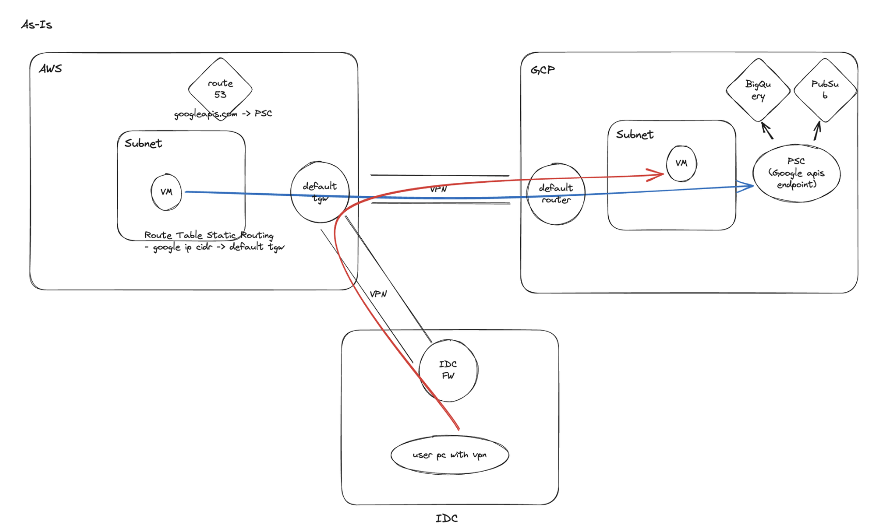

# Build new VPN architecture among AWS, GCP and On-Prem (Fault Demonstration and Testing)

- Language: Terraform
- Tag: Network, Security, VPN
- Period: 2023/10/19 → 2023/11/16

## Objective

- Make intuitive and simple hybrid and multi-cloud network architecture
- Get rid of single point of failure by dividing a Transit GateWay which on-prem and GCP uses together with multiple Transit GateWays which on-prem and GCP uses individually.
- Enhance network monitoring Dashboard

## Achievement

- Deeply Understand how BGP in AWS and GCP works(it is little bit different with general BGP).
- We made a simple and cool network architecture between AWS and GCP, also between On-Prem and Cloud providers.
- When working on a vpn connected between aws and on-prem, or when working on a vpn connected between AWS and GCP, can work safely without affecting each other.
- The network monitoring dashboard has been reinforced with CloudWatch and Cloud Monitoring.

## What I did

- I worked on this with an in-house network engineer, and I worked on cloud(AWS/GCP) network tasks with terraform.
- When I proceeded this network operation, there was big failure between AWS and GCP VPN tunnel. So I will explain below what kind of problem occurred and how we solved it.

## Failure we’ve experienced

[Before Failure]

- I’ve made a new TGW and Cloud Router to switch traffic between AWS and GCP.
- There was no failure at that time.

[Failure Occurrence]

- when we make vpn tunnel between IDC and GCP, failure occurs between AWS and GCP.

### what is impact of failure?

- The `*.googlapis.com` domain lookup on AWS creates an issue for all services that communicate with GCP.
- Almost all current targets that communicate with GCP on AWS use Private Service Connect.

## Investigate Failure

**First, I made a test network in aws and gcp.**

### **suspect** 1. (outbound) AWS ec2 → AWS default TGW

- There is no problem.

### suspect 2. (outbound) AWS default TGW → GCP default Cloud Router

- There is no problem.

- First of all, `default tgw` is being advertised from two routes for GCP ip address ranges.
- Directly advertised in GCP via `GCP default router`
- Advertised via IDC via `GCP IDC router` and `IDC FW`
- Therefore, two paths are created for the same GCP ip address ranges, and `default tgw`should be selected according to the priority of which path to go through for the same GCP ip address range.
- How to select path priority when communicating with external networks from AWS VPN to BGP

  1. longest match

  2. short AS path

  3. med

  4. who advertise first

1. longest match
   - Since the same GCP CIDR is advertised equally on both paths, both paths have the same priority.
2. short AS path

- I thought the path to the default router will take priority in ASPath.
  - default router → default tgw AS Path: 65151 (win)
  - IDC router → IDC FW → default tgw AS Path: 65801 65010
- **But in reality, both paths have the same priority** in AS Path. The reason is that when IDC advertises GCP band, it removes and delivers AS received from GCP through 'BGP Remove Private AS' (https://networklessons.com/bgp/bgp-remove-private-as)
  - default router → default tgw AS Path: 65151
  - IDC router → IDC FW → default tgw AS Path: 65010

1. med

- If a specific med value is not set when advertising to BGP from the other side, AWS internally recognizes med as 100.
- Since GCP and IDC do not advertise BGP because they set the med value separately, the med value of both paths is the same as 100.

4. who advertise first

- Since default router (direct advertising from GCP) advertised the GCP ip address ranges to AWS before IDC router (direct advertising from IDC), the path of default router (direct advertising from GCP) has priority.
  - GCP default router (win)
  - GCP IDC router & IDC FW
- If the GCP IDC router advertised the GCP band first, it means that outbound traffic does not go directly to the GCP, but goes to the GCP through the IDC (it has even been tested).
- Therefore, the routes advertised directly in the GCP have priority by comparing up to four times, so the outbound communication is initiated directly to the GCP rather than through the IDC.

### suspect 3. (outbound) GCP default Cloud Router → GCP private service connect

- There is no problem.

- I assumed that if the GCP VPC connected to the PSC is connected to the GCP Cloud Router, it will be routed by the Google internal forwarding rule, so there will be no problems here.

### suspect 4. (return) GCP private service connect → GCP IDC용 Cloud Router

- There is no problem.

- Traffic requested to the PSC must be returned to AWS (TCP).
- The AWS ip address range is advertised through the three Cloud Router ('AWS router', 'default router', and 'IDC router' of GCP, so you have to return to AWS through one of the three paths.
- The GCP PSC determines the path by referring to the routing table of the connected VPC Subnet.

- First of all, there are three paths for the AWS subnet CIDR called `10.36.0.0/16`.
- Two routes advertised directly on AWS
- One path advertised via IDC in AWS
- How to select path priority when GCP communicates with external networks through BGP

  1. longest match

  2. med

- Therefore, if there are multiple routes for the same destination, the GCP selects the path priority by considering only the `MED` value.
- In the routing table above, the VPN section connected to the **IDC Router has the highest priority of 0, so send return traffic through that section.**

### suspect 5. (return) GCP IDC용 Cloud Router → IDC FW

- Yes, there is a problem.

- There was a communication problem when sending return traffic from the GCP Cloud Router for IDC to IDC FW.
- At first, IDC FW didn't have any log left for return traffic, so I thought that async traffic from IDC Router or PSC on the GCP side could not be handled.
- However, when we received the packet from the VPN tunnel interface linked to Router for IDC through the GCP engineer, we found that a `synack` occurred in the tunnel interface between **GCP and IDC.**
- This means that return traffic went well through the GCP IDC Cloud Router, and connection issues occurred afterwards, and the problem was that IDC FW.

### suspect 6. (return) IDC FW → AWS default TGW

- IDC FW advertises the path to AWS as BGP, so I thought TGW would know the path advertised. In fact, even if IDC-GCP VPN interworking is done, IDC does not block access to AWS ec2, so there isn’t problem in this tunnel.

## Cause of Failure

- GCP Private Service Connect uses 443 for TCP communication.
- This means communicating with `3 way handshake`.

- Therefore, we decided to generate traffic and also try capturing packets in IDC FW.
- As a result of checking, all packets returned from GCP PSC to AWS ec2 were dropped from IDC FW. (Only `tcp retransmission` occurred)
- **From IDC FW's point of view, syn was not released from the port he had, but only syn-ack came from gcp, so he thought it was an attack and dropped the packet.**
- It was a drop, so it didn't leave any in the firewall log itself.

## Solution of Failure

- IDC FW filters to AWS and GCP (no advertising on the other band) to create advertising → only one path (AWS ↔ no path itself traveling through IDC when traffic between GCPs travels)
- Med value should also be advertised over 100 → Avoid failure situations by preventing routes through IDC from being selected by priority even if more than one route is created by human error
