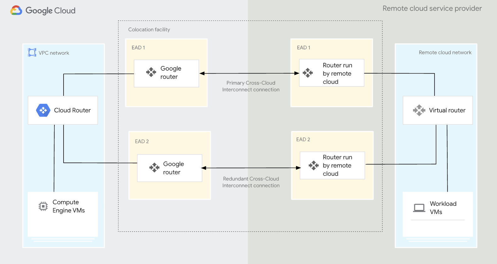

# Build cross-cloud interconnect between AWS and GCP

- Language: Terraform
- Tag: Network, cost-optimization

## Objective

- Optimize network performance with 2 lines of 10G capacity by migrating VPN to cross-cloud Interconnect.
- Optimize network cost with cheaper outbound traffic cost because of interconnect by migrating VPN to cross-cloud Interconnect.

## Achievement

- I’ve made a HA network architecture between AWS and GCP
  - A/A cross-cloud interconnect 2 lines
  - Backup: VPN 4 tunnels (with low med)
- Save network outbound traffic cost for GCP and AWS (also consider interconnect line cost)
  - GCP: 68% saving
  - AWS: 4% saving

- Maximize network capacity through active-active 10G lines.

## What I did

- I’ve ordered AWS Direct connect and GCP Cross-Cloud Interconnect
- I’ve set up VLAN for each cloud providers, and other network resources needed in inteconnect with terraform.
- I’ve also done failure test in AWS and GCP(Disable BGP).
- I also tracked network cost change.
- I also set Monitoring Dashboard for BGP communication in interconnect

