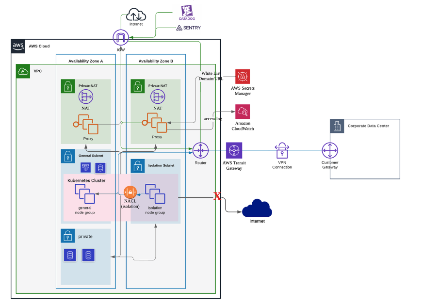

# Logical AirGap system & outbound proxy

- Language: Terraform
- Tag: AirGap, Kubernetes, Network, squid proxy
- Period: 2023/03/24 → 2023/05/09



## Objective

- We need to isolate sensitive information such as personal and financial information from general subnet which can be accessible.
- Separate services handling sensitive information with other general services (to isolation subnet).
- Developers can easily deploy their service to isolation subnet, if the service handles sensitive information.

## Achievement

- We made specific airgap(isolation) subnet for services handling sensitive information.
- It can be accessible for only authorized user’s VDI.
- It can’t sent traffic to internet except for some domain(SaaS monitoring system such as DataDog or Sentry)
  - Outbound proxy(squid proxy) filter specific domain that is allowed or not.

## What I did

- I set up this network infrastructure with another team member.
- I tested and set up squid proxy with terraform
  - how we operates squid proxy
    - If I updates the hosts that I want to allow for the specified secret manager
    - Shell script takes the corresponding value in 5-minute increments through the cron in the system and updates the configuration
    - Restart the squid proxy server.
    - Logs are collected and streamed through awslogsd.
- Guide how to deploy a service in kubernetes cluster to isolation(airgap) subnet

  - isolation **node group** is in isolation subnets.
  - isolation nodes have `taints` that block other general services(deployments)
  - but, if a services(deployment) which have to provision on isolation nodes have a `tolerations` and `NodeSelector` in the yaml file, this service will be provisioned on isolation node in airgap network.

  ```yaml
  ---
  spec:
  ---
  nodeSelector:
    group: isolation
  tolerations:
    - effect: NoSchedule
      key: group
      operator: Equal
  ```
