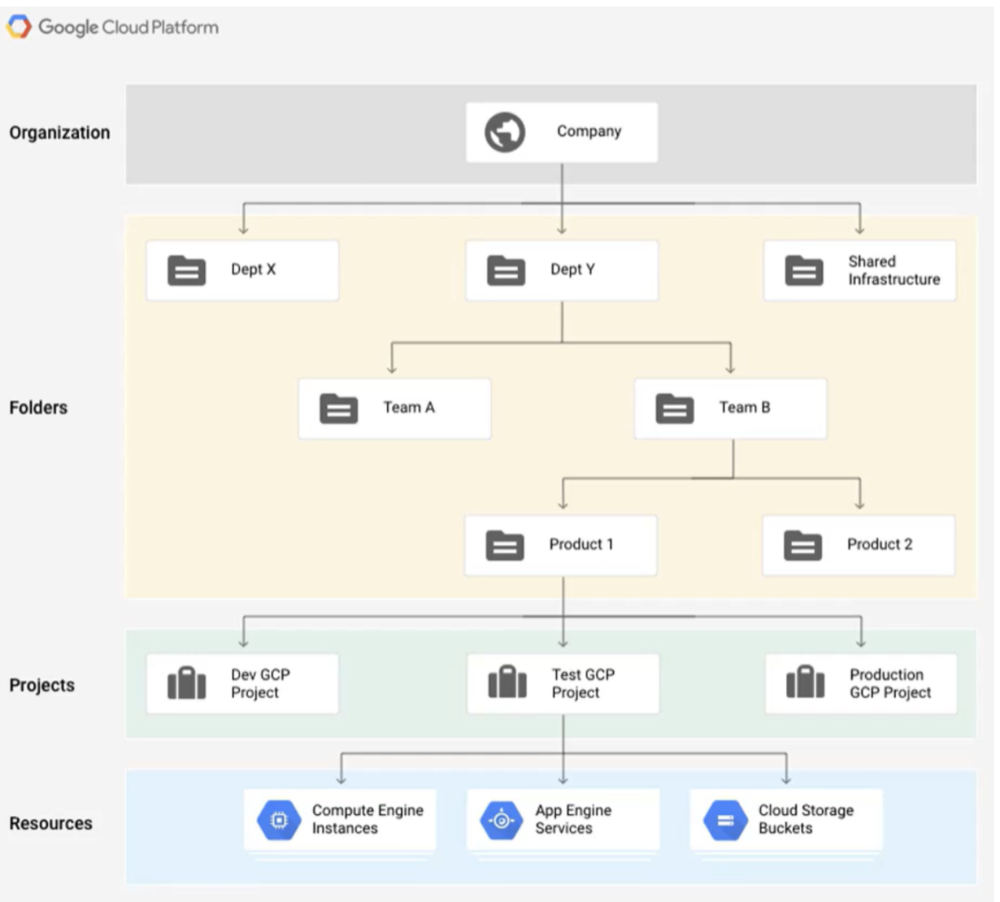

# Design new GCP project architecture aligned with DevOps culture and Develop Autorisation System

- Language: Golang, Python, Terraform
- Tag: DevOps, DevSecOps
- Period: 2024/01/02

- Google’s Best Practice for GCP Resource Architecture

- Our resources architecture

## Objective

- Make a DevSeCOps oriented GCP project architecture.
  - Developers can get GCP Role by themselves easily in developer platform
  - Unused role should be detached from GCP users automatically.
- Automate to making many GCP resources.
- Devide resources’ cost by project connected with a team.

## Achievement

- Make developers get GCP Role by themselves.
- If they don’t use the role over 30 days, Role will be detached from GCP user automatically.
- Every developers can query their audit logs in Integrated GCP Audit Logging System.

## What I did

- I’ve designed GCP project architecture with another developer who is interested in GCP.
- I’ve connected Okta user with GCP with one internal developer.

- I made some features related to GCP project and IAM
  - Developers can activate GCP project for each micro-service by themselves
  - Developers can attach GCP role by themselves.

- I made integrated audit logging system on GCP

- I made automated `permission retrieval system` on GCP with Golang, Cloud Run, Redis
