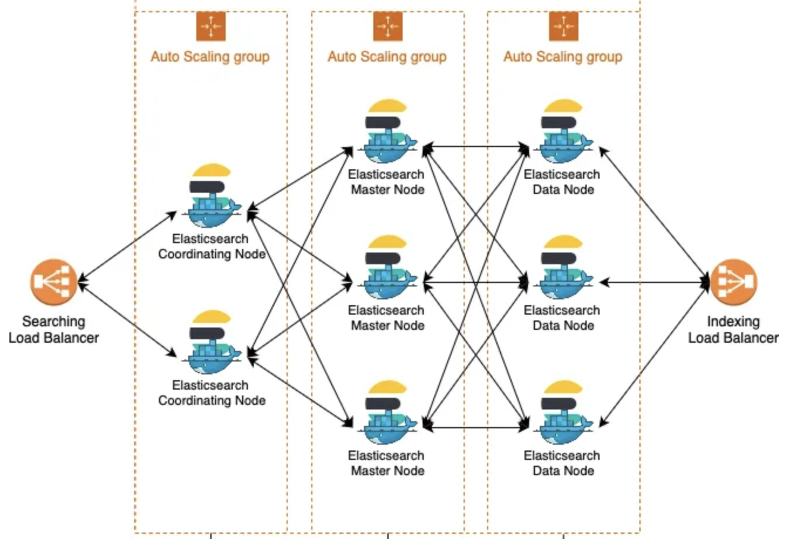
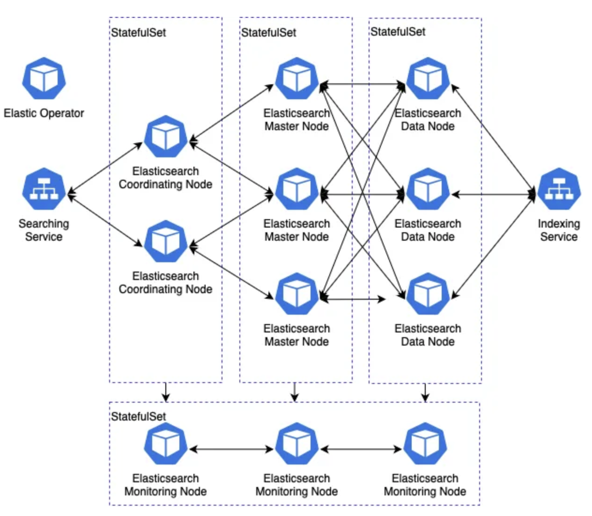

# Help to migrate ElasticSearch on vm to eck

- Language: Helm
- Tag: ElasticSearch, Kubernetes
- Period: 2023/02/09 → 2023/04/22

## Objective

- Migrate ES on vm to ECK(Elastic Cloud on Kubernetes).
  - before
    
  - after
    
  - Master Node: manage cluster status and index’s metadata
  - Coordinating Node: client node
  - Data Node: Index(shards)
  - send logs with Logstash
  - send metrics with Metricbeat
- Change from manual to automatic deployment
  - Before eck, Deployment(es version/plugin update) was so hard(manual jobs) and took long time
    - change ASG desired count
    - relocate shards to new nodes one by one
    - data huge → relocating is so slow
      - [indices recover max bytes](https://www.elastic.co/guide/en/elasticsearch/reference/current/recovery.html#recovery-settings)
      - [shard concurrent rebalancing](https://www.elastic.co/guide/en/elasticsearch/reference/current/modules-cluster.html#shards-rebalancing-settings)
  - easy deployment
  - easy version upgrade
- Optimize computing resources

## Achievement

- Remove manual deployment because rolling update in k8s
- Reduce deployment time (not shards relocating, but new pod will be attached to existing shards)

## What I did

## 1. ECK PoC (Making eck resources)

- eck installation
  - Yaml (CRDs)
  - **Helm chart
    `helm install elastic-operator elastic/eck-operator -n elastic-system --create-namespace`**
- ECK [OnDelete StatefulSet update strategy](https://www.elastic.co/guide/en/cloud-on-k8s/master/k8s-orchestration.html#k8s-statefulsets) (stateful controller)
  1. Delete existing pods(nodes) → unassigned shards (need replicas)
  2. Shard will be relocated to new pods

## 2. Help troubleshooting during poc

- There was no update, but TCP connection error in data nodes
  - istio sidecar in pod also manages connection
    - `sidecar injection: false`
  - [use case](https://discuss.elastic.co/t/nodes-being-dropped-from-cluster/263161)
  - Delete istio sidecar also lower cpu util
- Easy rollback with ArgoCD
