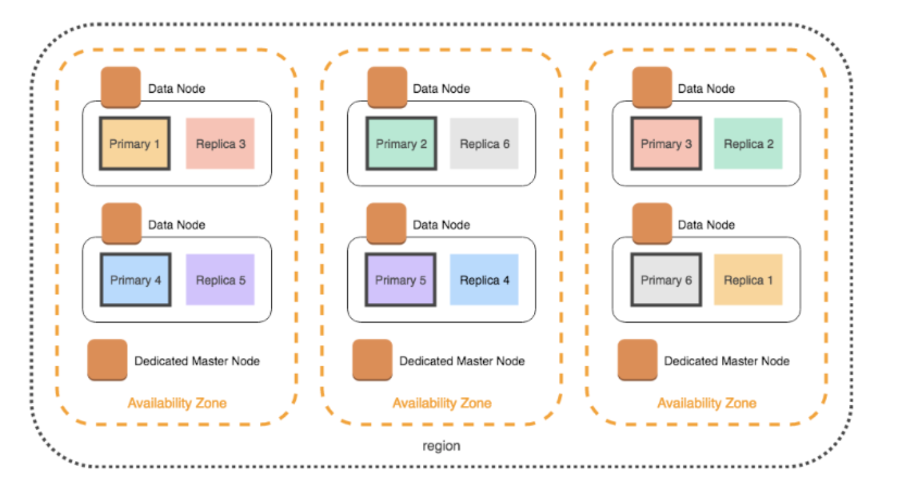

# Operate and Manage OpenSearch

- Language: Terraform
- Tag: ElasticSearch, OpenSearch

## Objective

- Operate opensearch clusters safely and efficiently.
- Share knowledge within the team related to opensearch and elasticsearch.

## Achievement

- Set up various opensearch cluster in multiple regions with terraform.
- I’ve made many documentation for sharing opensearch knowledge for SRE team.
- Cost/Search/Index optimization by setting proper shard sizes and shard numbers.
- Enhance Security by connecting SSO system to opensearch cluster.

## What I did

I’ve made guide book how to set up and operate opensearch in aws.

## 1. Build Opensearch Cluster and connect with Okta

- I build some Opensearch clusters and connecti with Okta
  - support SAML
- If fluentbit try to index data, some permissions needed.
  - IRSA(IAM Roles for Service Account)
  - Opensearch Access Policy
  - Map users(IRSA) to required roles in Opensearch Dashboard

- If we need search index between Multi (region) clusters, we can use [Cross-cluster Search](https://docs.aws.amazon.com/ko_kr/opensearch-service/latest/developerguide/cross-cluster-search.html)

## 2. Opensearch monitoring

- We monitor various important metric related with Opensearch cluster ([https://docs.aws.amazon.com/opensearch-service/latest/developerguide/cloudwatch-alarms.html](https://docs.aws.amazon.com/opensearch-service/latest/developerguide/cloudwatch-alarms.html))
  - AWS ES Free Storage is very low
  - AWS ES Cluster status is Yellow
  - AWS ES Cluster status is Red
  - AWS ES CPU monitor
  - AWS ES JVM memory pressure monitor
  - AWS ES PrimaryWriteRejected monitor
  - …
-

## 3. Opensearch ISM(Index State Managment)

- We transform index’s state with ISM
- e.g) after 1 day → Delete replica → after 7 days → Delete index …

## 4. Opensearch Index Template

- We use index template to set shard(primary & replica)’s number

## 5. Opensearch Upgrade

- We try to keep upgrade opensearch cluster to latest version
- blue/green deployment is convenient but, it takes too long

## 6. Opensearch shard number and size

- Shard strategy is so important to operate opensearch cluster([https://docs.aws.amazon.com/opensearch-service/latest/developerguide/bp.html#bp-sharding-strategy](https://docs.aws.amazon.com/opensearch-service/latest/developerguide/bp.html#bp-sharding-strategy))
- we always try to optimize shard’s size and shard’s number

