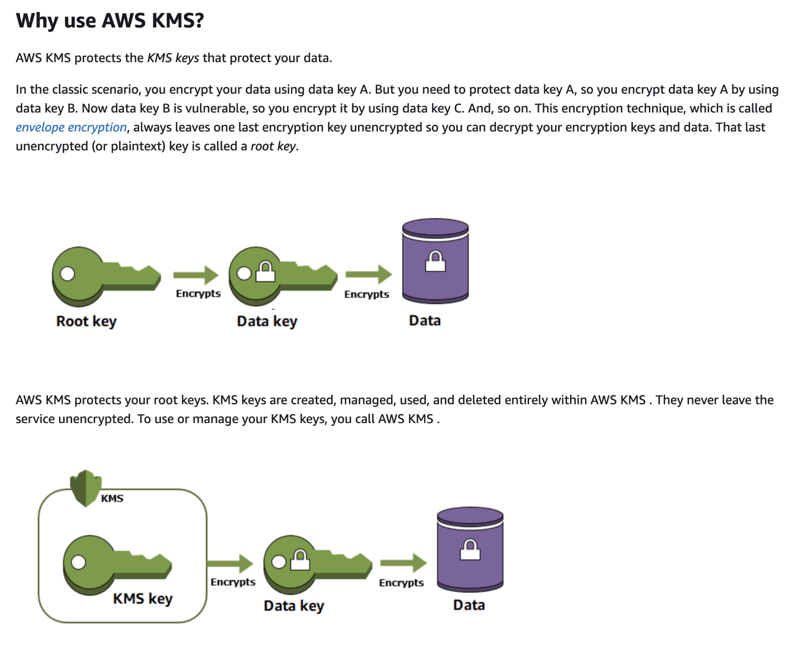

# 2 tier encryption with KMS key

- Language: Terraform, aws cli
- Tag: Security

## Objective

- Make KMS key easier with terraform.
- Make a process how to use KMS key for developers and naming rule for KMS key.
- Make an ACL for KMS key.

## Achievement

- SRE and Developers can easily set up and use KMS key.
- Authorization control is carried out to prevent all developers from accessing all KMS keys.
- Use `envelope encrytion` with KMS key for each service.

## What I did

- I’ve made a process how developer use KMS key and how SRE set up KMS key.
- I also add ACL to KMS key.
- Later, I want to make more intelligent way to manage KMS (using Github PR)
