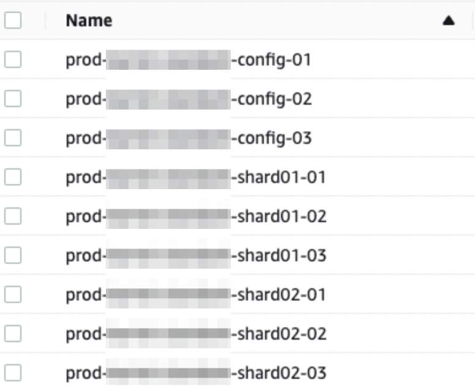

# MongoDB with terraform

- Language: Terraform
- Tag: MongoDB
- Period: 2022/02/21 → 2022/04/01

## Objective

- The DB team wanted to automate bothering highly manual tasks on to configure MongoDB on ec2, So we decided to remove the manual tasks
  - Before I made terraform module for MongoDB, DB team had to make multiple ec2 instances with multiple placement groups, route53 record, linux setting(disk mount, RAID settings, db agent, install mongoDB)
- When creating MongoDB in the DB team, make it easy to create MongoDB and focus operate MongoDB without much thought about networks, place groups, security groups, ec2 IAM Role, and tagging.

## Achievement

- I made a terraform module for mongoDB instances
- I removed highly manual tasks when DB team make mongoDB instances in aws console

## What I did

- Create MongoDB instance by separating instances by az (availability zone)
  - If we need to create three MongoDB instances and have three a,b,c, set one instance for each az
  - If we need to create three MongoDB instances and have two zones, set two in a zone and one in b zone
- Apply Placement Group for mongoDB instances
  - Create a placement group for mongoDB instances’ partition-type so that each ec2 instance can be created across multiple racks
- Create Placement Group by Replica-set (shard) and by config
  - MongoDB single
    - placement group : alpha-{name}-main
  - MongoDB cluster
    - placement group(shard1) : alpha-{name}-shard01
    - placement group(shard2) : alpha-{name}-shard02
    - placement group(config) : alpha-{name}-config
- Configure AMI by Region
  - Even though ami Names can be the same for each region, but the AMI ID is different, so it should be configured according to the region
- Instance Type
  - When using t-series instance type, add extra ebs volume instead of SSD
  - If ebs is a type with a “d” or “i” at the end of the instance class name, such as m5d/r5d, and if you have more than two SSDs, configure RAID in script
- Instance General Settings (Network, IAM Role, Termination Prevention, Monitoring Reflects)
- Instance Tag Settings
  - Environment, Name, Team, datadog and etc
- Security Group settings
- ssh key setting and SSM manager settings
  - By default, guide to use Session Manager, not ssh key
- Set new record on Route53 and rename MongoDB instance
