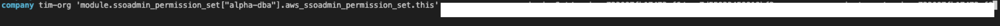

# Migrating AWS SSO Permission Set Resources to Terraform

- Language: AWS, Terraform
- Tag: IaC, SSO
- Period: 2021/12/07 → 2021/12/21

## Objective

- Creating sso permission sets, manually assigning to aws accounts, and similar tasks are often repeated, e.g) modifying all of the inline policies of the four permission sets.
- The need to manage the history of changes in the sso permission set
- Reduce the permission set created daily by existing group and account

## Achievement

- Creating sso permission sets, manually assigning to aws accounts, and similar tasks are often repeated, e.g) modifying all of the inline policies of the four permission sets.
  - Create modules for aws_soadmin_permission_set and aws_soadmin_account_assignment
  - Divide the directory for each group and create a permission set used by the group, divide the directory for each account, and assign the permission set used by each account to the account.
- The need to manage the history of changes in the sso permission set
  - Create s3 backend for .tfstate file storage
- Reduce the permission set created daily by existing group and account
  - Previously, several permission sets that play the same role for each account were created. After migration to terraform, divide into alpha/prod/common to create a unified permission set
  - Reduce the unnecessarily generated permission set by existing group and account

## What I did

### 1. Make permission set terraoform module

- Module 1. ([https://registry.terraform.io/providers/hashicorp/aws/latest/docs/resources/ssoadmin_permission_set](https://registry.terraform.io/providers/hashicorp/aws/latest/docs/resources/ssoadmin_permission_set))
  - aws_ssoadmin_permission_set
  - aws_ssoadmin_permission_set_inline_policy
  - awss_ssoadmin_managed_policy_attachment
- Module 2 ([https://registry.terraform.io/providers/hashicorp/aws/latest/docs/resources/ssoadmin_account_assignment](https://registry.terraform.io/providers/hashicorp/aws/latest/docs/resources/ssoadmin_account_assignment))
  - aws_ssoadmin_account_assignment

### 2. Create terraform backend (s3+dynamodb)

- Create dynamoDB table for lock when working on s3 backend and terraform for tfstate storage.

### 3. Create calling terraform module part

- Module 1 creates a permission set by dividing directories by group.
- Module 2 assign permission set to AWS Accounts

### 4. terraform import

- Import Permission set terraform file that was not previously created as a terraform and save it in a tfstate file.
- If you do terraform plan/apply after importing AWS Resources, the existing permission set is not destroyed but only changed.
- Since I used for_each and modules, it was a little complicated to do terraform import, but I just need to see and apply official documents. For each terraform resource, the instruments required for import are different.
- permission set import
  
- account assignment import
  
