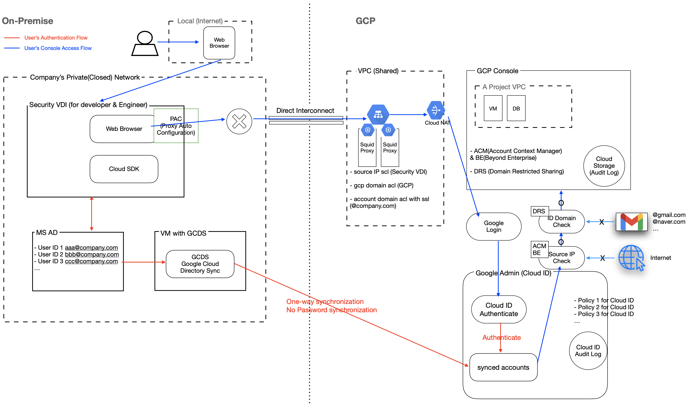
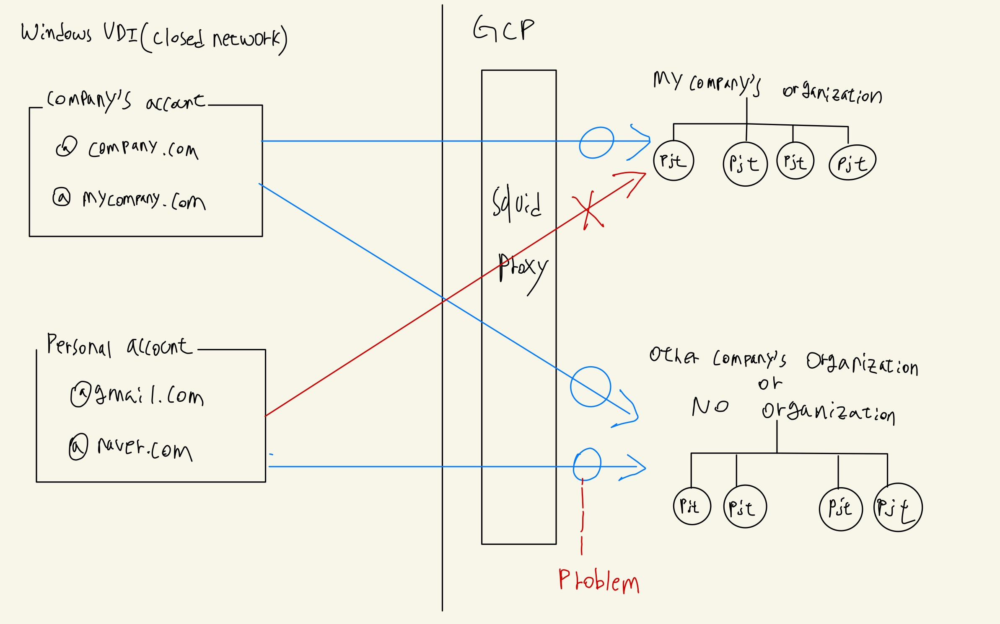
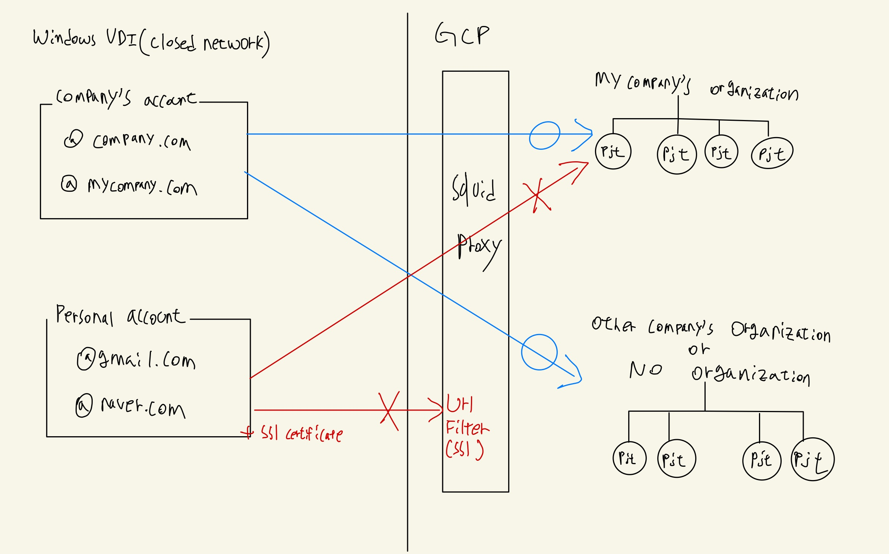

# Establish and operate enterprise standard GCP console access and account framework (Squid Proxy, GCDS, Google Admin)

- Tool / Platform: Bash, Cloud ID, GCP, Google Admin, gcloud
- Work Position: DevSecOps Engineer, Project Manager
- Period: 2020/10/20 → 2021/02/28

## Objective

- Security Enhancement
- Convenience Enhancement

## Achievement

- Security Enhancement
  - Manage and trace GCP Usage history of GCP users(employee) by using only ad based cloud ID and blocking account ID used for non-business such as @gmail.com or @naver.com
  - Block GCP console connections in the internet environment, allow GCP console connections only on the closed network
  - Manage safely account with google admin's(cloud ID) account security setting
  - Manage account's audit log easily with google admin(cloud ID)
- Convenience Enhancement
  - Easy to Make GCP Account (just set PW in Cloud ID)
  - Easy to access GCP Console even on company's closed network. (There is no handling exception for GCP Domain)



## Method

### 1. [Access] GCP Squid Proxy

- VM Spec : n1-standard-1, ubuntu:18.04, 50G Disk
- Install squid proxy : [https://phoenixnap.com/kb/setup-install-squid-proxy-server-ubuntu](https://phoenixnap.com/kb/setup-install-squid-proxy-server-ubuntu)
  - generate ssl certificate (to block allowed user's account like "aaa@company.com")
  - Change squid proxy config
  - Operate ssl_db, Create cache directory & Change owner ([https://wiki.squid-cache.org/ConfigExamples/Intercept/SslBumpExplicit](https://wiki.squid-cache.org/ConfigExamples/Intercept/SslBumpExplicit))
  - Restart squid

### 2. [Access] GCP FW Set up

- Create "Allow" rule
  - Type : receive
  - Target : squid (NW Tag)
  - Source Filter : On-Premise VDI IP
  - Protocol/Port : 3128(tcp), icmp

### 3. [Access] Public Cloud - On-Premise Connection with Direct Interconnect

### 4. [Access] Create Cloud NAT with Public IP (But, without Internet traffic)

- Public IP is just used for connection with Other Google's Service such as GCP Console, Google Admin, Google Groups and etc. (GCP Console can be linked with Public IP)

### 5. [Access] Test squid proxy with entering GCP Console using browser proxy (For Test)

- Browser(Chrome) → Settings → proxy → Manual → squid proxy IP : 3128
- f there is a PAC script(auto browser proxy setting) in your browser, you have to change the PAC script. So, we can access GCP Console without manual browser proxy settings.
  - example PAC file
    - Sample Code
      ```bash
      # It is just script file to access GCP Console & Services regarding with GCP
      if (dnsDomains(host, "googleapis.com")) {return "PROXY squidIP:Port";}
      if (dnsDomains(host, "cloud.google.com")) {return "PROXY squidIP:Port";}
      ...
      ...
      ```
  - If there is a problem when accessing GCP Console after applying Browser proxy settings, Find What Domains cause problem with F12(developers tool)

### 6. [Account Authentication] one-way synchronization with Google Cloud Directory Sync (MS AD → Google Cloud Identity)

- Install GCDS in Window VM linked with AD
- AD synchronization
  - no password synchronization because of NW Load
  - No default PW because of security
  - Batch synchronization at every 2:00 AM
  - expecting 200~250 people use GCP

### 7. [Account Authentication] Domain Restricted Sharing & squid proxy URL Filtering

- DRS (Allow Only Your Company's Domain registered in Cloud ID to access your GCP Resources)
- Squid Proxy URL Filtering
  - You can't block accessing GCP Resources which is not located under your GCP Organization (Unmanaged GCP Resources) with Unmanaged Accounts such as @gmail.com, @notyourcompanydomain.com which is not managed in Google Cloud ID. (Unmanaged Accounts)
  - So you have to use squid url filtering & SSL certificate in order to deny using unmanaged accounts (you can check this setting in 1.squid proxy)

### 8. [Access] ACM(Access Context Manager) & BE(Beyond Enterprise)

- Source IP Deny except for allowed VDI
  - Create ACM : Select your GCP Organization → Security → create new Access Context Manager → NAT Public IP Allow OR 0.0.0.0/0 Deny
  - Create Group : [admin.google.com](http://admin.google.com) → Groups → make your all user belong to this group
  - apply BE : select any GCP project under your gcp organization → Security → Beyond Enterprise → organization select → Managed Access → Add → apply ACM & Group you created
- In order to use cloud sdk in VDI(windows)
  - https://cloud.google.com/sdk/docs/downloads-versioned-archives?hl=ko

### 9. [Account Authentication] Transfer Unmanaged Cloud ID to Managed Cloud ID

- Unmanaged Cloud ID : Google ID which have your company's domain like "aaa@yourcompany.com" but not managed in Google Admin(admin.google.com). Unmanaged Cloud ID is made because Account's Owner have made their Account in Google by oneself.
- Managed Cloud ID : Google ID which have your company's domain like "aaa@yourcompany.com" and managed in Google Admin(admin.google.com). Managed Cloud ID is made because AD users is synchronized to Cloud ID or Administrator who have control Google Admin make Cloud ID("aaa@yourcompany.com") in Google Admin
- Conflicted Cloud ID : There are Unmanaged Cloud ID and Managed Cloud ID same time for same user. It is Conflicted Cloud ID. Conflicted Cloud ID is made because Unmanaged Account is not transferred before Managed Account is made by AD sync or Administrator.
  - To avoid making Conflicted Cloud ID, you must transfer unmanaged cloud ID to managed cloud ID with 'transfer tool for unmanaged users(automatic email for unmanaged users to transfer to managed cloud ID)' in advance.
  - If there is conflicted cloud ID, you'll keep getting annoying pop-ups(have to choose unmanaged Cloud ID or Managed Cloud ID) whenever conflicted ID user login. 🥵

### 10. [Cloud ID Policy]

- AD Passwords are not synced to Cloud ID.
- PW expiry date : 90 days
  - After 90 days, Users have to change their PW to enter GCP Console
- 2 Step Verification
- Block Other Google Services except GCP, Google Groups and Google Admin
- Cloud ID Login Session Control

### 11. [GCP Resource Structure]


- If someone register their account to Organization Admin to use GCP, Organization Admin set initial password which that should be changed after login.
- Then GCP users who are granted GCP Cloud ID, can access GCP Resources after TA or IAM Admin gives IAM Role to the GCP Users.
- If security admin or operation team member want to apply some GCP Policies into Organization Level or Folder Level or Project Level, They can apply the GCP Policies to the all levels of resources.

### 13. [Audit Log] Setting up Cloud ID Audit Log Storage in GCP

- Audit log of cloud ID is stored automatically in Cloud Admin but, it only is retained until for 3 months
- If we store audit log of cloud ID periodically in cloud storage with using google admin's API, we can store audit log of cloud ID for a long time
- Automatically store daily audit log of cloud ID with using cloud Function and cloud scheduler
  - Language : Python
  - Daily batch transfer of cloud ID audit log
  - [https://developers.google.com/admin-sdk/directory/v1/guides/manage-users](https://developers.google.com/admin-sdk/directory/v1/guides/manage-users)

## If there is a system failure?

- What if the squid proxy fails?
  - Solution 1
    - [ ] Restart squid proxy and check for squid daemon(service)
  - Solution 2
    - [ ] Delete Group that all member belong to in Cloud ID. (BE policy will be released automatically)
    - [ ] Announce people to access GCP temporarily in the internet
    - [ ] Fix squid proxy
- What if a Cloud ID, GCP function, or GCDS failure?
  - Solution 1
    - [ ] Case Open
    - [ ] Ask for help from Google Engineer.
- What if MS AD fails?
  - Solution 2
    - [ ] Ask for help from team who is in charge of AD

## Project Issues that I had

- Cloud Premium Edition
  - Issue
    - Officially, If Cloud ID Administrator wants to manage more than 50 users, Cloud ID free tier edition needs to be upgraded to premium edition(must pay for premium edition).
    - Although it might be small costs compared to the importance of this project, but we want to save the costs.
  - Resolution
    - We Opened support case that we want to use cloud ID in free tier edition, to Google in GCP.
    - My Company already had many workloads on GCP. So We can use Cloud ID(Google Admin) for free.
- We couldn't handle Company's AD Setting(OU, Group)
  - Issue
    - Actually, when we first started the project, we tried to synchronize only the GCP users to the Cloud ID in the existing AD. But AD's Setting is not designed for Cloud ID which is one-way synchronized from AD. It means that AD was not using OU(Organization Unit) and Group for GCP users. So it is hard to identify and synchronize actual users of GCP in AD. Also AD was not a system managed and operated by our team.
  - Resolution
    - So we asked a team that have been managing AD, to just synchronize all employees in the IT or technology sector to Cloud ID in daily batch
    - And OU, Group and PW management is now performed from Cloud ID by our team.
    - Group and PW management is easy to performed with Google Admin's function.
    - Because we want to manage only GCP users(someone who has logged in cloud ID before) in specific OU, we proceeded with the development of a simple script code(move user OU or lock user based on login history).
- PAC(Proxy Auto Configuration) File or Windows Host File
  - Issue
    - At first, I thought that the host file in Windows VDI was the first referenced when we searched GCP. So we set the GCP-related domain to Squid Proxy IP by modifying the host file for Windows VDI. ([console.cloud.google.com](http://console.cloud.google.com/) 172.xx.xx.xx)
    - But PAC File is first referenced in browser such as Edge or Chrome when we searched some url in those browser.
  - Resolution
    - We asked team that managed windows VDI to change PAC File (add GCP related Domain in PAC file)
- Conflicted Account
  - Issue
    - Even before we managed accounts(@lguplus.co.kr) from cloud ID, there were people who created accounts with that domain from Google. The account is classified as unmanaged in the Cloud ID.
    - If we have tried to synchronize those unmanaged accounts from AD to Cloud ID, There were managed accounts and unmanaged accounts for same users at the same time. And this is called conflicted accounts.
    - If there is a conflicted accounts, one who has conflicted accounts, will receive irritating pop up to choose managed accounts or unmanaged accounts everytime he or she try to login.
    - We shouldn't have caused to make conflicted accounts before we synchronize AD users by transferring unmanaged accounts to managed accounts.
  - Resolution
    - Send e-mail to transfer unmanaged accounts with managed accounts by transferring tool. (admin.google.com → Transfer tool for unmanaged users → select users → Email transfer requests)
    - If there are conflicted accounts
      
    - If there aren't conflicted accounts
      
- Can't use Cloud Shell because of ACM and BE
  - Issue
    - We couldn't use cloud shell when authenticating GKE users and connecting GKE.
    - It is because we already had set up ACM and BE. (Source IP ACL) \* Cloud NAT IP is source IP
    - GCP users could't use GKE with cloud shell which is micro vm in google and doesn't have static ip.
  - Resolution
    - We prepared Cloud SDK(windows) in VDI environment.
    - Also, It was also possible to prevent the use of cloud shells.
- Personal accounts can be used in closed network
  - Issue
    - Personal accounts are available for other company's GCP organizations or no organization that are not covered by ACM & BE.
    - In spite of closed network environment, if someone logged in personal account in closed network and access other company's GCP resources or no organization's GCP resources, **he or she can leak important data from closed network environment.** And it is hard to trail that account's activity because that account is not managed in Google Admin(cloud ID)
      
  - Resolution
    - We can block personal accounts's login by changing squid proxy's config file.
    - Make openssl certificate in squid proxy and give it to windows VDI.
    - Then, when someone log-in, squid proxy check account's domain (check https header) (google provide native function of packet filtering for google login with us)
      
    - Make web proxy check account's domain when log- in google
      [https://support.google.com/a/answer/1668854?hl=en#zippy=%2Cstep-choose-a-web-proxy-server](https://support.google.com/a/answer/1668854?hl=en#zippy=%2Cstep-choose-a-web-proxy-server)
