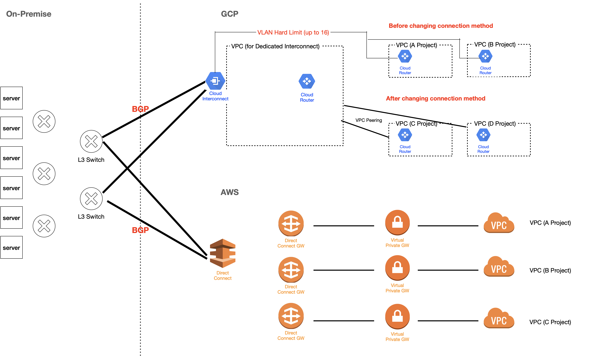
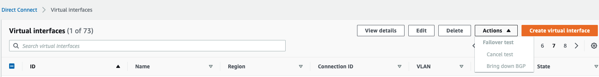

# Operating AWS/GCP Interconnect (Direct Connect, Dedicated Interconnect)

- Tool / Platform: AWS, AWS Direct Connect, GCP, GCP Cloud Interconnect, Transit GateWay, VPC Peering
- Work Position: Public Cloud Engineer, Public Cloud Network Engineer
- Period: 2020/06/02

## Objective

- Security Enhancement
- Cost Cutting
- Shorten Interconnect connection period
- Ensure operational Reliability and Stability

## Achivement

- Security Enhancement
  - Make a secure dedicated network connection from on premises to AWS/GCP. Using AWS Direct Connect, we create a private connection between AWS and your datacenter, office, or colocation environment.
  - It is a dedicated connection, not a shared connection with other company.
- Cost Cutting
  - Redundant costs have been reduced by about 90% by integrating and operating dedicated lines that had been built on a project-by-project basis.
- Shorten Interconnect connection period
  - The period of connection period was reduced (8 weeks → 1 week) by integrating and operating dedicated lines that had been built on a project-by-project basis.
- Ensure operational Reliability and Stability
  - QoS control, Interconnect service's Monitoring Dashboard and alarm service increase operational efficiency.]

## Method

### [GCP dedicated Interconnect Connection]

### 1. Allocate Private IP (VPC Subnet - CIDR)

- Efficiently assign private IP to each CSP company's VPC characteristics, and Save unnecessary private IP
  - Unlike Other subnet, GCP VPC reserves four IPs per subnet by default. (/29 → we can use only 4 IPs in the subnet)
  - Least CIDR of GCP subnet is /29. We can't use /30 for GCP Subnet
  - There are three types of GCP subnets.
    1. Subnets that directly connect to other VPCs or On-Premise (VPC Subnet) → need to be assigned
    2. Subnets managed by google but advertised to other VPC (http LB proxy subnet) → need to be assigned
    3. Subnets managed by google and not advertised to other VPC and On-Premise (Private Connection : Cloud SQL, Cloud Function, App Engine) → not need to be assigned
  - **We don't assign private IP for GKE Service and Pods IP because of masquerade.**

### 2. Advertise Public Cloud's IP (make a BGP session)

- Make VPC Peering between vpc for project and vpc for dedicated interconnect
- Advertise private IP of project's VPC that is needed to be connected to On-Premise with GCP Cloud Router

### 3. Advertise On-Premise's IP (make a BGP session)

- Make VLAN and advertise whole on-premise IPs (supernetting)

### 4. Allow Firewall

- Allow FW in On-Premise

### 5. Monitoring Dashboard

- We can make monitoring dashboard in GCP Stackdriver and Cloud Interconnect's default monitoring dashboard is also useful

### [AWS Direct connect Connection]

### 1. Allocate Private IP (VPC Subnet - CIDR)

- Efficiently assign private IP to each CSP company's VPC characteristics, and Save unnecessary private IP
  - Unlike Other subnet, AWS VPC reserves five IPs per subnet by default. (/28 → we can use only 11 IPs in the subnet)
  - Least CIDR of GCP subnet is /28. We can't use /29 for AWS Subnet
  - **We don't assign private IP for AWS Service and Pods IP because there are already CIDR subent for CNI(100.64.0.0/10 and 198.19.0.0/16).**
    - Make secondary CIDR for EKS CNI
      [https://aws.amazon.com/ko/premiumsupport/knowledge-center/eks-multiple-cidr-ranges/](https://aws.amazon.com/ko/premiumsupport/knowledge-center/eks-multiple-cidr-ranges/)

### 2. Advertise Public Cloud's IP (make a BGP session)

- Make a VIF for each direct connection
- Make a Direct Connect GateWay and Virtual Private Gateway in project's Account
- Associate DCGW, VPGW to VIF

### 3. Advertise On-Premise's IP (make a BGP session)

- Make VLAN and advertise whole on-premise IPs (supernetting)

### 4. Allow Firewall

- Allow FW in On-Premise

### 5. Monitoring Dashboard

- We can make monitoring dashboard in AWS CloudWatch and make an specific Alarm with AWS SNS

## Issues that I had

- Fail over test by each VIF (AWS)
  - Issue
    We sometimes want to do fail over test by each VIF(vlan) easily
  - Resoultion
    In AWS, we can do failover test easily in management console during the time we choose
    
- VLAN Hard Limit Issue (GCP)
  - Issue
    We originally have made each project create VLAN in their project and associate it with shared Cloud Interconnect service. But there are hard limit to make VLAN for each Cloud Interconnect (up to 16).
  - Resolution
    We changed connection method. Make a Peering from VPC for projects to VPC for cloud interconnect. After we changed connection method, we can connect lots of VPC in GCP to cloud interconnect service.
- CNI subnet for EKS (AWS)
  - Issue
    NW engineers who had to make EKS, want to get private IP for CNI(service, pod). But It is too a lot. So we couldn't assign private IP for them
  - Resoultion
    We recommended the engineers to use SNAT and secondary CIDR for CNI from the 100.64.0.0/10 and 198.19.0.0/16 ranges which were suggested from AWS.
- Physically failure of all dedicated Line
  - Issue
    If a dedicated line path fails, you cannot respond if there is no redundancy
  - Resolution
    - Make a quick Site to Site VPN Line to failover
    - But we could't make extra VPN at all times in order to prepare for dedicated line failure

[Establish enterprise standard GCP console access and account framework (Squid Proxy, GCDS, Google Admin)의 사본](https://www.notion.so/Establish-enterprise-standard-GCP-console-access-and-account-framework-Squid-Proxy-GCDS-Google-Ad-a897eb6e7d5b4f858c2845b703c8d650?pvs=21)
