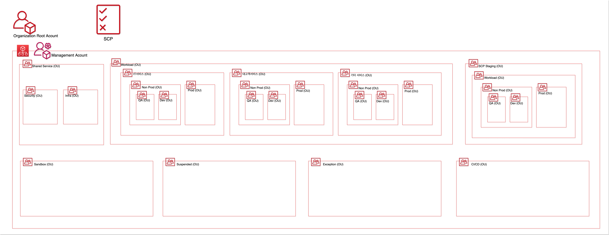

# Establish and operate enterprise standard AWS SSO user management and AWS account structure framework (AWS SSO, AWS Control Tower)

- Tool / Platform: AWS, AWS CloudTrail, AWS Control Tower, AWS Directory Service, AWS Organiztion, AWS SSO
- Work Position: DevSecOps Engineer, Project Manager, SSO Admin
- Period: 2021/06/08

## Objective

- Security Enhancement
- Convenience Enhancement

## Achievement

- Security Enhancement
  - Users who use AWS don't have to make AWS IAM user for each account. So a user only have only one SSO user among multi AWS accounts. It is more secure for Identity credentials.
  - Block AWS Console connections in the internet environment, allow AWS Console connections only on the closed network.
  - Manage safely account with SSO users account security setting (MFA, permission sets).
  - Strengthen security governance by applying Control Tower's Guardrail(SCP and Config).
  - Manage users' audit log easily with CloudTrail.
- Convenience Enhancement
  - There's no need to make AWS IAM users anymore for people anymore (except for service account which doesn't have arn = not aws service). Because On-Premise AD users are Synchronized to AWS SSO. Authentication for users is done in On-Premise AD.
  - Easy to access AWS multi accounts by accessing SSO link if the user have been granted proper permission from SSO permission manager(SSO Admin) for the accounts.
  - Strengthen security governance easily and automatically by applying Control Tower's Guardrail(SCP and Config).

![[AWS SSO] We don't use 2)Business cloud applications and 3)Custom SAML applications yet.
Sources : [https://aws.amazon.com/ko/blogs/korea/aws-single-sign-on-seoul-region/](https://aws.amazon.com/ko/blogs/korea/aws-single-sign-on-seoul-region/)](Establish%20and%20operate%20enterprise%20standard%20AWS%20SSO%20%2036f7226c2e9e4ca9821ca829bc2ee173/Untitled.png)

[AWS SSO] We don't use 2)Business cloud applications and 3)Custom SAML applications yet.
Sources : [https://aws.amazon.com/ko/blogs/korea/aws-single-sign-on-seoul-region/](https://aws.amazon.com/ko/blogs/korea/aws-single-sign-on-seoul-region/)

![[AWS Organization] This Account framework was originally planned first. But Control Tower haven't supported nested OU. So we changed OU structure. [https://docs.aws.amazon.com/singlesignon/latest/userguide/manage-your-identity-source.html](https://docs.aws.amazon.com/singlesignon/latest/userguide/manage-your-identity-source.html)](./images/OU.png)

[AWS Organization] This Account framework was originally planned first. But Control Tower haven't supported nested OU. So we changed OU structure. [https://docs.aws.amazon.com/singlesignon/latest/userguide/manage-your-identity-source.html](https://docs.aws.amazon.com/singlesignon/latest/userguide/manage-your-identity-source.html)

![[AWS Control Tower] It is customized to our company's situation. Control Tower doesn't support nested OU yet.](./images/Uplus_Control_Tower.png)

[AWS Control Tower] It is customized to our company's situation. Control Tower doesn't support nested OU yet.

## Method

### 1. [Preset] Switch from a billing-only account to an administrative account

- Organizational management account was only playing the role of billing account for organizational member accounts. So, This management account has to be turned to administrative account which can enable AWS SSO, AWS Organization, AWS Control Tower and etc
- Management account requests EAF(Enable All Features) to organizational member accounts via emails which are sent from AWS
  [https://docs.aws.amazon.com/ko_kr/organizations/latest/userguide/orgs_manage_org_support-all-features.html](https://docs.aws.amazon.com/ko_kr/organizations/latest/userguide/orgs_manage_org_support-all-features.html)
- After all member accounts accept EAF, management account can use organizational services

### 2. [AWS SSO] AD-AWS SSO Sync and Settings

- Assign private IP for AWS AD Connector. AWS AD Connector can't have static IP
- As using Direct Interconnect, connect AD with AWS AD Connector
- Create AWS Directory Service and set-up to connect AD
- Change Identity source in AWS SSO to 'Active Directory'
  - [https://docs.aws.amazon.com/singlesignon/latest/userguide/manage-your-identity-source.html](https://docs.aws.amazon.com/singlesignon/latest/userguide/manage-your-identity-source.html)
- SSO Test
  - Create Permission Set based on job function
  - Assign Permission Set to AD based User
  - Login Test
  - MFA Test (Google Authenticator)
- Custom SSO Link : https://~~~~~.awsapps.com/start (We can set this link only one time)

### 3. [AWS SSO] Design Permission Sets for our company's users who use AWS Console

- Analyze permission policy used by IAM Users of existing AWS member accounts
- Design company's standard permission sets(12 permanent, 1 temporary) which may increase in the future
- This permission sets are based on default job-function and analyzed IAM permission policy
  - We added common custom policies(source IP ACL) to all permission sets
    So, Users who are assigned permission sets we designed can only access VDI in closed network
- To reflect ABAC(Attribute Based Access Control), SSO Admin can create new permission sets which satisfy ABAC
- Precautions : Deleting Permission Sets also affects users who have previously been assigned Permission sets

### 4. [AWS Organizations] Setting Up initial OU(Organizations Units) and SCP(Service Control Policies

- In initial stage of this project, we designed AWS OU and Account Framework like under image
- But Control Tower didn't support nested OU, So we changed plan from managing OU and SCP separately in AWS Organization to more automation in the Control Tower.



- We designed initial SCP like under items. But Control Tower can automate those SCP
  - Deny User, Group Creation
  - Deny using Root users
  - Restrict AWS Region for AWS regional services
  - Deny stopping CloudTrail
  - and so on

### 5. [Access] Make environment to access AWS Console from closed network via web proxy like squid

- You can see it in GCP account project

### 6. [Control Tower] Enabling Control Tower

- Someone who want to enable Control Tower has to have administrator policy(Full Access)
- After Enabling Control Tower and Registering OU, Accounts Under registered OU can be protected by Control Tower's default Guardrail
  - Example : Cannot use Root user, Users have to use MGA, Cannot delete S3 bucket without MFA ...
- Because control Tower doesn't support nested OU, We couldn't apply same OU structure to Control Tower.
- We can detect Guardrail violation with CT Dashboard or by email by using AWS CloudTrail, AWS SNS, AWS CloudWatch Alert Service

## Project Issues that I had

- IAM Permission Policy - permission boundary
  - Issue
    We must not see Billing Data because of MSP policy. So we don't use Admin Policy in Management Account
  - Resolution
    We used IAM Permission boundary to restrict IAM, Billing
- Permission Set is basically RBAC
  - Issue
    We can not control Permission between ec2s in same account
  - Resolution
    With ABAC, we can control permission between ec2s which have tags in same account
- We can even use personal AWS accounts as well as corporate AWS Accounts in closed network
  - Issue
    We can even access personal AWS root users as well as corporate AWS root users in closed network
  - Resolution
    We used Security Web GW that can control root users' access by accounts' domain.
- Config Recorder and Delivery channel are already made in AWS Accounts
  - Issue
    If Config Recorder and Delivery channel are made in AWS Accounts, OU which contains the AWS Accounts can't be registered in control tower
  - Resolution
    - If you want to register an OU to control tower, delete config recorder and delivery channel first in the AWS Accounts which is under the OU
      ([https://docs.aws.amazon.com/controltower/latest/userguide/troubleshooting.html](https://docs.aws.amazon.com/controltower/latest/userguide/troubleshooting.html))
    - Using AWS CLI, Delete Config settings for AWS Accounts that have already enabled AWS Config.
    ```bash
    $ aws configservice stop-configuration-recorder --configuration-recorder-name NAME-FROM-DESCRIBE-OUTPUT
    $ aws configservice delete-delivery-channel --delivery-channel-name NAME-FROM-DESCRIBE-OUTPUT
    $ aws configservice delete-configuration-recorder --configuration-recorder-name NAME-FROM-DESCRIBE-OUTPUT
    ```
    - If an authorized error occurs even though you have sufficient privileges when entering the command above, place AWS Accounts outside the OU and run the command again (temporarily move AWS Accounts to an environment that does not have specific SCP applied).
